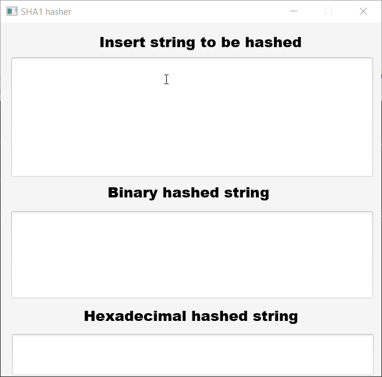

Using the algorithm
====================
You can use the algorithm of this project simply in 2 ways:
1) Building the project from source.
2) Executing the [jar file](https://github.com/michaelcozzolino/SHA1/releases/download/1.0.0/Sha1-1.0.0.jar) :

    `java -jar Sha1-1.0.0.jar`
    
    
